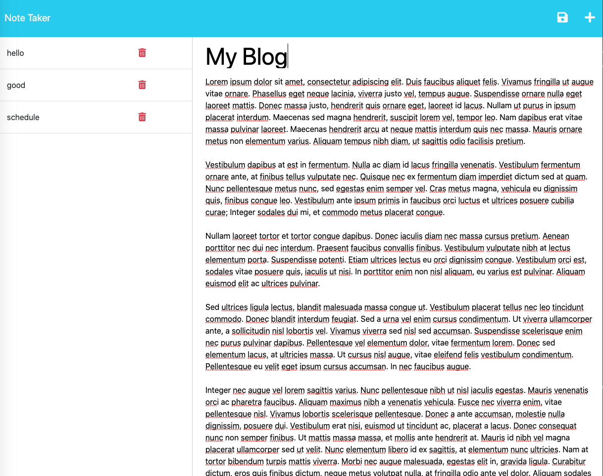

# Express JS Note Taker App

## Description

  

This project required building a Note Taker App to generate and save notes with unique IDs in a JSON file. The application front end connects to an Express.JS back end, and the application is deployed to Heroku.

  

## Install

Following cloning of the project, run the code:

```npm i```

in your CLI to install relevant packages.

  

## Usage

Following package installation, run the code

```node server.js```

in the CLI.

This generates the server - view on localhost: 3001

To end server in CLI: enter control +c.

 ## LINKS

**The URL of the functional, deployed application on HEROKU**
 https://fast-earth-60015.herokuapp.com/notes

  

**The URL of the GitHub repository***
https://github.com/BeverleyTiare/Express-Note-Taker

 



## Acknowledgement

Bootcamp TAs, tutors, opensource code sites, W3 schools, MDN, stackoverflow, medium, full stack blog.


## License

MIT License

  

Copyright © 2023 BeverleyTiare

  

Permission is hereby granted, free of charge, to any person obtaining a copy of this software and associated documentation files (the “Software”), to deal in the Software without restriction, including without limitation the rights to use, copy, modify, merge, publish, distribute, sublicense, and/or sell copies of the Software, and to permit persons to whom the Software is furnished to do so, subject to the following conditions: The above copyright notice and this permission notice shall be included in all copies or substantial portions of the Software.

  

THE SOFTWARE IS PROVIDED “AS IS”, WITHOUT WARRANTY OF ANY KIND, EXPRESS OR IMPLIED, INCLUDING BUT NOT LIMITED TO THE WARRANTIES OF MERCHANTABILITY, FITNESS FOR A PARTICULAR PURPOSE AND NONINFRINGEMENT. IN NO EVENT SHALL THE AUTHORS OR COPYRIGHT HOLDERS BE LIABLE FOR ANY CLAIM, DAMAGES OR OTHER LIABILITY, WHETHER IN AN ACTION OF CONTRACT, TORT OR OTHERWISE, ARISING FROM, OUT OF OR IN CONNECTION WITH THE SOFTWARE OR THE USE OR OTHER DEALINGS IN THE SOFTWARE.